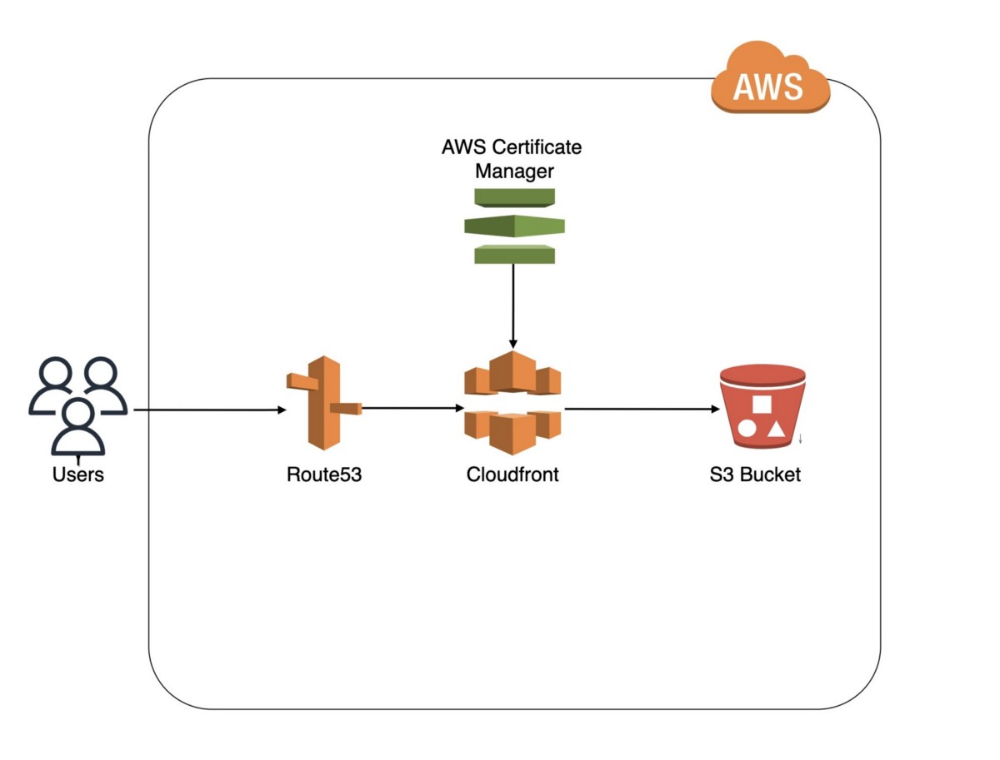

# terraform-s3-static-website

Terraform for hosting a secure static website hosted on AWS using S3.



There is a [step by step guide] for this Terraform Script.

The terraform will set up the following components:

- S3 bucket for www.yourdomain.com which will host your website files.
- S3 bucket for yourdomain.com which redirects to www.yourdomain.com.
- SSL certificate for yourdomain.com.
- Cloudfront distribution for www S3 bucket.
- Cloudfront distribution for S3 bucket redirect.
- Route 53 records for:
  - root
  - www

## Using this repository

### Create your S3 bucket to store your state files.

Create a new S3 bucket manually to store your state files. This should have the following policy set:

```
{
    "Version": "2012-10-17",
    "Statement": [
        {
            "Effect": "Allow",
            "Principal": {
                "AWS": "arn:aws:iam::1234567890:root"
            },
            "Action": "s3:ListBucket",
            "Resource": "arn:aws:s3:::yourdomain-terraform"
        },
        {
            "Effect": "Allow",
            "Principal": {
                "AWS": "arn:aws:iam::1234567890:root"
            },
            "Action": [
                "s3:GetObject",
                "s3:PutObject"
            ],
            "Resource": "arn:aws:s3:::yourdomain-terraform/*"
        }
    ]
}
```

Where `1234567890` is replaced with your AWS account ID and `yourdomain-terraform` is replaced with the name of your S3 bucket.

### Update your provider settings

In `providers.tf` update the bucket (`yourdomain-terraform`) and region (`eu-west-1`) parameters to match your setup. Note, the `acm_provider` needs to point to `us-east-1` for Cloudfront to be able to use it.

### Update the variables

In `terraform.tfvars` update the variables with the name of your domain and S3 bucket. You can just replace `yourdomain` with your actual domain.

Generally you will want to call you S3 bucket the name of your domain but if that is not possible (due to a conflict) then you can call it something else.

## Commands to run

- `terraform init` - To initialise the project and download any required packages.
- `terraform plan` - To see what has changed compared to your current configuration.
- `terrform apply` - To apply your changes.

The terraform scripts are set up to validate your SSL certificate via email. So you should receive an email from AWS to `webmaster@yourdomain.com or admin@yourdomain.com` when running apply which you need to approve in order for the SSL certificate to be validated.

Alternatively, I have left the code for DNS validation in which can be uncommented if you don't have email set up (`acm.tf` and `route53.tf`).

Note however, that DNS validation requires the domain nameservers to already be pointing to AWS. You won't actually know the nameservers until after the NS route 53 record has been created. Alternatively, you can follow the validation instructions from the ACM page for your domain and apply to where your nameservers are currently hosted. DNS validation can take 30 minutes or more during which the terraform script will still be running.

## Post Changes

Once the terraform scripts have been run successfully you will need to upload your scripts to your `www.yourdomain.com` S3 bucket.

At the very least you need an `index.html` and a `404.html` file.

You can upload the contents of a directory to your S3 bucket by using the command:

```
aws s3 sync . s3://www.yourdomain.com
```

Whenever you make changes to the files in your S3 bucket you need to invalidate the Cloudfront cache.

```
aws cloudfront create-invalidation --distribution-id E3EDVELPIKTLHJ --paths "/*";
```

Where `E3EDVELPIKTLHJ` is the Cloudfront ID associated with your www S3 bucket.
